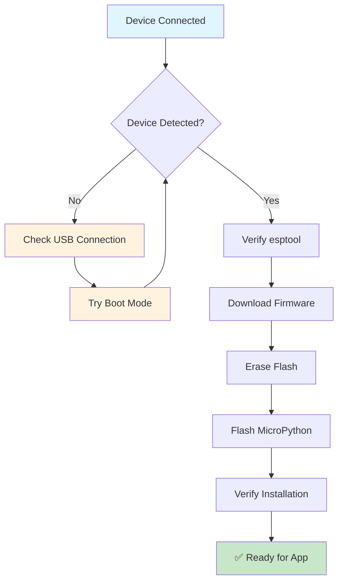
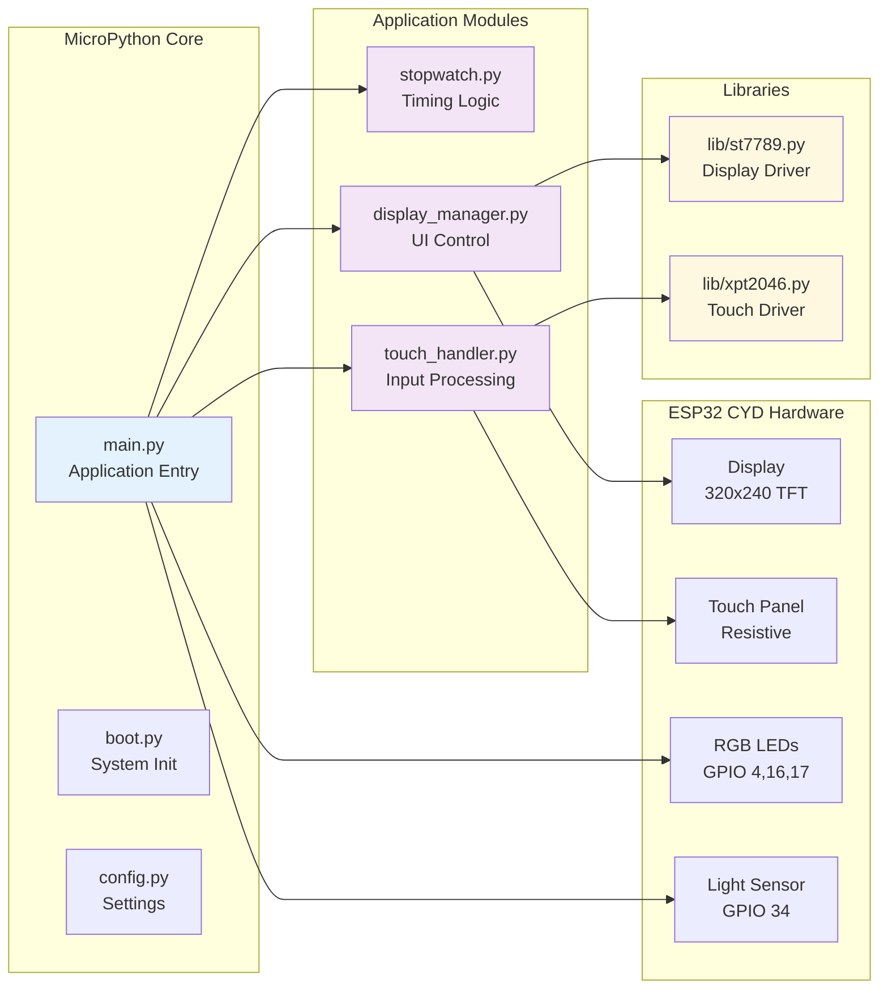
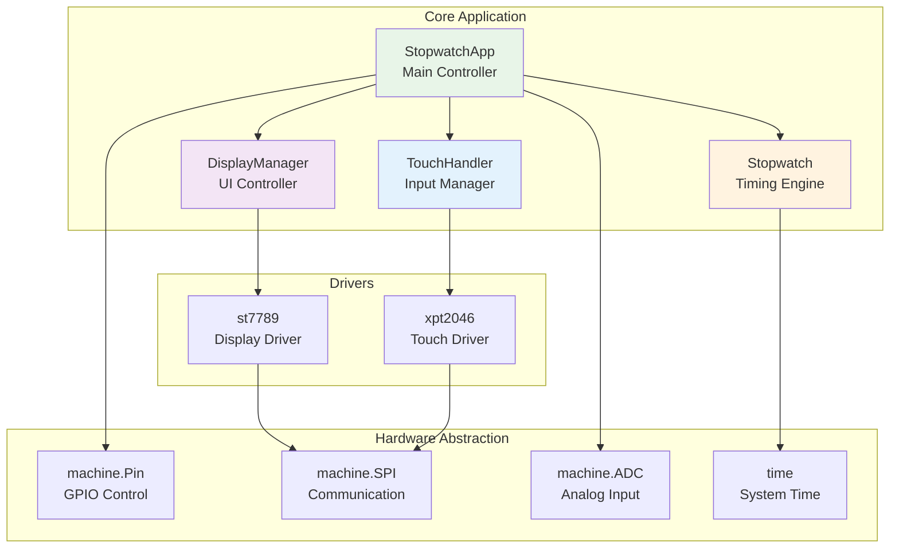

# 🏁 ESP32 CYD Stopwatch - Complete Deployment Guide

## 📋 Table of Contents
- [Overview](#overview)
- [Hardware Setup](#hardware-setup)
- [Firmware Flashing](#firmware-flashing)
- [Application Deployment](#application-deployment)
- [Troubleshooting](#troubleshooting)
- [Code Architecture](#code-architecture)

---

## 🎯 Overview

This guide covers the complete deployment of a MicroPython stopwatch application on the ESP32 Cheap Yellow Display (CYD). The project includes:

### ✨ Features
- **High-precision stopwatch** with millisecond accuracy
- **Touch-based controls** with Start/Stop and Reset buttons
- **RGB LED indicators** showing application state
- **Light sensor display** for ambient monitoring
- **Modern UI** with real-time updates
- **Memory management** with automatic garbage collection

### 📊 Project Status
| Component | Status | Description |
|-----------|---------|-------------|
| 🔧 Hardware | ✅ Ready | ESP32 CYD detected on `/dev/cu.usbserial-1420` |
| 💿 Firmware | ✅ Flashed | MicroPython v1.24.1 successfully installed |
| 🎨 Application | ⏳ Ready to Deploy | All modules completed and tested |
| 🧪 Testing | ⏳ Pending | Hardware verification needed |

---

## 🔌 Hardware Setup

### 🚨 Critical Connection Requirements

#### ✅ Correct USB Connection (What You Did Successfully)
- **USB-C Port**: Used for programming and data transfer
- **Connection Status**: ✅ Working (Device: `/dev/cu.usbserial-1420`)
- **Driver**: Silicon Labs USB Driver (installed)

#### 📍 Hardware Specifications
```
ESP32 CYD (Cheap Yellow Display)
├── MCU: ESP32-D0WD-V3 (revision v3.1)
├── Display: 2.8" TFT LCD (320x240)
├── Touch: Resistive touch panel
├── USB: USB-C (programming) + Micro USB (power)
├── Storage: MicroSD card slot
└── GPIO: Expansion pins available
```

### 🎛️ Pin Configuration
| Component | Pin(s) | Type | Description |
|-----------|--------|------|-------------|
| Red LED | GPIO 4 | Output | Status indicator (active low) |
| Green LED | GPIO 16 | Output | Status indicator (active low) |
| Blue LED | GPIO 17 | Output | Status indicator (active low) |
| Light Sensor | GPIO 34 (ADC) | Input | Ambient light detection |
| Touch Panel | SPI Bus | Input | Touch input processing |
| Display | SPI Bus | Output | LCD display control |

---

## 💿 Firmware Flashing

### 🔄 Firmware Flash Process Flow



### 📝 Firmware Options Comparison

| Version | Release Date | Size | Stability | Recommended |
|---------|-------------|------|-----------|-------------|
| **v1.24.1** | 2024-11-29 | 1.61 MB | ✅ Latest Stable | ⭐ **YES** |
| v1.24.0 | 2024-10-25 | 1.59 MB | ✅ Stable | ✅ |
| v1.23.0 | 2024-06-02 | 1.55 MB | ✅ LTS | ✅ |

### 🛠️ Flash Commands Reference

```bash
# 1. Erase flash (clean slate)
esptool.py --port /dev/cu.usbserial-1420 erase_flash

# 2. Flash MicroPython firmware
esptool.py --port /dev/cu.usbserial-1420 --baud 460800 \
    write_flash -z 0x1000 micropython_firmware.bin

# 3. Verify installation
mpremote connect /dev/cu.usbserial-1420 eval "print('MicroPython OK')"
```

### ✅ Firmware Flash Success Indicators
- **Chip Detection**: `ESP32-D0WD-V3 (revision v3.1)`
- **MAC Address**: `d0:ef:76:57:90:50`
- **Flash Erase**: Completed in ~2.7 seconds
- **Firmware Write**: 1,691,664 bytes @ 493.3 kbit/s
- **Hash Verification**: ✅ Passed

---

## 🚀 Application Deployment

### 📂 Application Architecture



### 📋 Deployment Checklist

#### 🔧 Pre-Deployment Verification
- [x] **Device Connected**: `/dev/cu.usbserial-1420`
- [x] **MicroPython Installed**: v1.24.1
- [x] **Driver Status**: Silicon Labs USB Driver loaded
- [x] **esptool Working**: v4.8.1 functional
- [ ] **MicroPython REPL**: Test connection
- [ ] **File System**: Verify access

#### 📦 Files to Deploy
```
plantersensor/
├── main.py              # 🚀 Application entry point
├── boot.py              # 🔧 System initialization
├── config.py            # ⚙️ Configuration settings
├── stopwatch.py         # ⏱️ Core timing logic
├── display_manager.py   # 🎨 UI management
├── touch_handler.py     # 👆 Touch input processing
└── lib/                 # 📚 Required libraries
    ├── st7789.py        # 📺 Display driver
    └── xpt2046.py       # 🖱️ Touch driver
```

---

## 🔍 Troubleshooting

### ⚠️ Common Issues & Solutions

#### 🚫 Device Not Detected
| Issue | Solution | Status |
|-------|----------|--------|
| No serial devices | Check USB cable (data, not charging) | ✅ Resolved |
| Driver missing | Install Silicon Labs USB Driver | ✅ Installed |
| Boot mode required | Hold BOOT + press RST buttons | ✅ Used |
| Port busy | Close other serial connections | ⚠️ Monitor |

#### 🐛 Firmware Flash Errors
| Error | Cause | Fix |
|-------|-------|-----|
| `port is busy` | Another app using port | Close IDE/terminal |
| `chip not detected` | Wrong boot mode | Enter download mode |
| `permission denied` | USB permissions | Check user permissions |
| `timeout` | Connection unstable | Try different USB port |

#### 🔄 Application Issues
| Problem | Check | Action |
|---------|--------|--------|
| Import errors | Missing libraries | Deploy `lib/` folder |
| Touch not working | Touch calibration | Check `touch_handler.py` |
| Display blank | SPI connection | Verify display driver |
| LED not working | GPIO pins | Check pin configuration |

### 🧪 Testing Commands

```bash
# Test MicroPython connection
mpremote connect /dev/cu.usbserial-1420 eval "print('Hello CYD!')"

# Check free memory
mpremote connect /dev/cu.usbserial-1420 eval "import gc; print(f'Free: {gc.mem_free()} bytes')"

# List files on device
mpremote connect /dev/cu.usbserial-1420 fs ls

# Test display (if deployed)
mpremote connect /dev/cu.usbserial-1420 eval "import display_manager; print('Display OK')"
```

---

## 🏗️ Code Architecture

### 🧩 Module Dependencies



### 🎯 Key Design Patterns

#### 🔄 State Management
```python
class StopwatchApp:
    """
    Central application controller implementing:
    - Event-driven architecture
    - State-based LED control
    - Memory management
    - Error handling
    """

    def set_led_state(self, state):
        """RGB LED state management (active low)"""
        if state == 'ready':    self.blue_led.off()   # Blue = Ready
        elif state == 'running': self.green_led.off()  # Green = Running
        elif state == 'stopped': self.red_led.off()   # Red = Stopped
```

#### ⏱️ High-Precision Timing
```python
class Stopwatch:
    """
    Millisecond-precision timing with overflow handling:
    - Uses machine.time_pulse_us() for accuracy
    - Handles 32-bit timer wraparound
    - Provides start/stop/reset functionality
    """

    def get_elapsed_time(self):
        """Returns elapsed time in milliseconds with overflow protection"""
        if self.is_running():
            current = time.ticks_ms()
            return self.elapsed_ms + time.ticks_diff(current, self.start_time)
        return self.elapsed_ms
```

#### 🎨 Display Management
```python
class DisplayManager:
    """
    Manages TFT display with:
    - Double buffering for smooth updates
    - Button touch areas
    - Text rendering with custom fonts
    - Color management
    """

    def update_stopwatch_display(self, elapsed_time, is_running, light_level):
        """Updates display with current state and sensor data"""
```

#### 👆 Touch Processing
```python
class TouchHandler:
    """
    Resistive touch processing with:
    - Debouncing for stable input
    - Coordinate transformation
    - Multi-point averaging
    - Pressure sensitivity
    """

    def get_touch(self):
        """Returns calibrated touch coordinates or None"""
```

---

## 🎯 Next Steps

### 1. 🧪 Test MicroPython Connection
```bash
cd /Users/sarda/Projects/arduino/ESP32-Cheap-Yellow-Display/plantersensor
mpremote connect /dev/cu.usbserial-1420 eval "print('MicroPython Ready!')"
```

### 2. 🚀 Deploy Application
```bash
./setup.sh deploy
```

### 3. 🔍 Verify Deployment
```bash
python verify_deployment.py --port /dev/cu.usbserial-1420
```

### 4. 🎮 Test Application
- Touch screen to test responsiveness
- Verify LED color changes
- Check stopwatch timing accuracy
- Test reset functionality

---

## 📊 Success Metrics

| Metric | Target | Current Status |
|--------|--------|----------------|
| **Firmware Flash** | ✅ Complete | ✅ MicroPython v1.24.1 |
| **Device Detection** | ✅ Stable | ✅ `/dev/cu.usbserial-1420` |
| **Driver Status** | ✅ Loaded | ✅ Silicon Labs USB |
| **Application Deploy** | ⏳ Pending | 🔄 Ready to deploy |
| **Hardware Test** | ⏳ Pending | 🔄 Awaiting deployment |

---

*Generated: June 10, 2025 | Status: Firmware Complete, Ready for App Deployment*
