# ESP32 CYD MicroPython Firmware Deployment Guide

## Overview

This comprehensive guide documents the complete process of deploying MicroPython firmware to the ESP32 Cheap Yellow Display (CYD) device, including hardware setup, connection troubleshooting, firmware flashing, and application deployment.

## Table of Contents

1. [Hardware Requirements](#hardware-requirements)
2. [Connection Architecture](#connection-architecture)
3. [Software Dependencies](#software-dependencies)
4. [Connection Troubleshooting](#connection-troubleshooting)
5. [Firmware Flashing Process](#firmware-flashing-process)
6. [Application Deployment](#application-deployment)
7. [Verification and Testing](#verification-and-testing)
8. [Troubleshooting Matrix](#troubleshooting-matrix)
9. [Standards and Best Practices](#standards-and-best-practices)

## Hardware Requirements

### ESP32 CYD Device Specifications
- **Chip**: ESP32-D0WD-V3 (revision v3.1)
- **Features**: WiFi, BT, Dual Core, 240MHz, VRef calibration in efuse
- **Crystal**: 40MHz
- **MAC Address**: d0:ef:76:57:90:50 (example)
- **Display**: 2.8" ILI9341 TFT with capacitive touch
- **USB-to-Serial Chip**: Varies by manufacturer (CH340, CP210x, or FTDI)

### USB Connection Requirements

> **⚠️ CRITICAL CONNECTION ISSUE IDENTIFIED**
>
> **Problem**: User connected device to **USB-C port only**
>
> **Solution**: ESP32 CYD requires **Micro USB port** for programming/data transfer

#### Connection Ports Comparison

| Port Type | Purpose | Programming Support | Data Transfer | Power Only |
|-----------|---------|-------------------|---------------|------------|
| **Micro USB** | Programming/Data | ✅ **YES** | ✅ YES | ✅ YES |
| **USB-C** | Power Only | ❌ **NO** | ❌ NO | ✅ YES |

#### Correct Connection Method

```mermaid
---
title: ESP32 CYD USB Connection Architecture
---
flowchart LR
    subgraph Computer ["💻 Computer"]
        USBPort["USB-A Port"]
    end

    subgraph Cable ["🔌 USB Cable"]
        CableUSBA["USB-A Male"]
        CableMicroUSB["Micro USB Male"]
        CableUSBA ---|Data + Power| CableMicroUSB
    end

    subgraph ESP32CYD ["🔧 ESP32 CYD"]
        MicroUSBPort["📱 Micro USB Port<br/>(Programming/Data)"]
        USBCPort["🔌 USB-C Port<br/>(Power Only)"]
        SerialChip["USB-to-Serial<br/>Converter"]
        ESP32Chip["ESP32-D0WD-V3"]

        MicroUSBPort --> SerialChip
        SerialChip --> ESP32Chip
        USBCPort -.->|Power Only| ESP32Chip
    end

    USBPort --> CableUSBA
    CableMicroUSB --> MicroUSBPort

    style MicroUSBPort fill:#90EE90
    style USBCPort fill:#FFB6C1
    style SerialChip fill:#87CEEB
```



## Connection Architecture

### Device Detection Flow

```mermaid
---
title: ESP32 Device Detection and Connection Flow
---
flowchart TD
    Start([🚀 Start Device Detection]) --> CheckUSB{📱 Check USB Connection}

    CheckUSB -->|Micro USB Connected| CheckDrivers{🔧 Check Drivers}
    CheckUSB -->|USB-C Only| USBCError[❌ USB-C Port Error<br/>Must use Micro USB]

    CheckDrivers -->|Drivers Found| CheckSerial{📡 Check Serial Devices}
    CheckDrivers -->|No Drivers| InstallDrivers[💾 Install USB-to-Serial Drivers]

    CheckSerial -->|Device Found| CheckBootMode{⚡ Check Boot Mode}
    CheckSerial -->|No Device| BootModeHelp[🔄 Enter Boot Mode Instructions]

    CheckBootMode -->|Normal Mode| EnterBootMode[⚡ Enter Boot Mode]
    CheckBootMode -->|Boot Mode| DeviceReady[✅ Device Ready for Flashing]

    BootModeHelp --> EnterBootMode
    EnterBootMode --> DeviceReady
    InstallDrivers --> CheckSerial

    DeviceReady --> FlashFirmware[🔧 Flash MicroPython Firmware]
    FlashFirmware --> VerifyFlash{✅ Verify Flash Success}

    VerifyFlash -->|Success| DeployApp[📱 Deploy Stopwatch Application]
    VerifyFlash -->|Failure| TroubleshootFlash[🔍 Troubleshoot Flash Issues]

    DeployApp --> TestApp[🧪 Test Application]
    TestApp --> Complete([🎉 Deployment Complete])

    USBCError --> FixConnection[🔧 Connect via Micro USB]
    FixConnection --> CheckDrivers

    TroubleshootFlash --> CheckBootMode

    style USBCError fill:#ff6b6b
    style DeviceReady fill:#51cf66
    style Complete fill:#69db7c
    style FixConnection fill:#ffd43b
```



## Software Dependencies

### Required Tools and Versions

| Tool | Version | Purpose | Installation |
|------|---------|---------|--------------|
| **Python** | 3.8+ | Script execution | `brew install python` |
| **esptool** | v4.8.1+ | ESP32 firmware flashing | `pip install esptool` |
| **mpremote** | Latest | MicroPython device communication | `pip install mpremote` |
| **USB Drivers** | Latest | USB-to-serial communication | Platform specific |

### Driver Matrix by USB-to-Serial Chip

| Chip Type | Driver Required | macOS Installation | Detection Command |
|-----------|-----------------|-------------------|------------------|
| **CH340/CH341** | Yes | [WCH Driver](https://github.com/WCHSoftGroup/ch34xser_macos) | `kextstat \| grep -i ch34x` |
| **CP210x** | Yes | [Silicon Labs VCP](https://www.silabs.com/developers/usb-to-uart-bridge-vcp-drivers) | `kextstat \| grep -i silabs` |
| **FTDI** | Usually Built-in | [FTDI VCP](https://ftdichip.com/drivers/vcp-drivers/) | `kextstat \| grep -i ftdi` |

### Current System Status

```bash
# Detected Configuration
✅ Silicon Labs USB Driver: /Library/Extensions/SiLabsUSBDriver.kext
✅ esptool Version: v4.8.1
✅ Python Environment: Active
❌ Device Connection: USB-C only (INCORRECT)
```

## Connection Troubleshooting

### Step-by-Step Connection Resolution

#### Step 1: Verify Physical Connection

```mermaid
---
title: Physical Connection Verification Process
---
flowchart LR
    subgraph Current ["❌ Current Setup"]
        Computer1["💻 Computer"]
        USBC1["🔌 USB-C Cable"]
        CYD1["📱 ESP32 CYD<br/>USB-C Port"]
        Computer1 --> USBC1 --> CYD1
    end

    subgraph Correct ["✅ Correct Setup"]
        Computer2["💻 Computer"]
        MicroUSB["📱 Micro USB Cable<br/>(Data + Power)"]
        CYD2["📱 ESP32 CYD<br/>Micro USB Port"]
        Computer2 --> MicroUSB --> CYD2
    end

    Current -.->|Fix Connection| Correct

    style Current fill:#ffebee
    style Correct fill:#e8f5e8
```



#### Step 2: Enter Boot Mode

ESP32 devices require specific boot mode for firmware flashing:

```mermaid
---
title: ESP32 Boot Mode Entry Process
---
flowchart TD
    Start([🔌 Device Connected<br/>via Micro USB]) --> Method1{🎯 Choose Method}

    Method1 -->|Method 1| Connected[📱 Device Connected]
    Method1 -->|Method 2| Disconnected[🔌 Disconnect Device]

    Connected --> HoldBoot1[⏯️ Hold BOOT Button]
    HoldBoot1 --> PressReset1[🔄 Press & Release EN/RST]
    PressReset1 --> ReleaseBoot1[🔓 Release BOOT Button]
    ReleaseBoot1 --> CheckSerial1[📡 Check Serial Device]

    Disconnected --> HoldBoot2[⏯️ Hold BOOT Button]
    HoldBoot2 --> Reconnect[🔌 Reconnect Device<br/>while holding BOOT]
    Reconnect --> Wait[⏱️ Wait 3 seconds]
    Wait --> ReleaseBoot2[🔓 Release BOOT Button]
    ReleaseBoot2 --> CheckSerial2[📡 Check Serial Device]

    CheckSerial1 --> Verify{✅ Device Appears?}
    CheckSerial2 --> Verify

    Verify -->|Yes| Success[🎉 Boot Mode Active<br/>/dev/cu.usbserial-XXXX]
    Verify -->|No| TryAgain[🔄 Try Alternative Method]

    Success --> ReadyFlash[🚀 Ready for Flashing]
    TryAgain --> Method1

    style Success fill:#51cf66
    style ReadyFlash fill:#69db7c
    style TryAgain fill:#ffd43b
```



#### Step 3: Device Detection Commands

```bash
# Check for USB serial devices
ls -la /dev/cu.usb*

# Expected output after correct connection:
# /dev/cu.usbserial-1420 (or similar)

# Verify esptool can communicate
esptool.py --port /dev/cu.usbserial-XXXX chip_id

# Expected output:
# Chip is ESP32-D0WD-V3 (revision v3.1)
# MAC: d0:ef:76:57:90:50
```

## Firmware Flashing Process

### Firmware Selection Matrix

| Version | Release Date | Stability | Features | Recommended For |
|---------|--------------|-----------|----------|-----------------|
| **v1.24.1** | 2024-11-29 | Stable | Latest features | ✅ **Recommended** |
| **v1.24.0** | 2024-10-25 | Stable | Recent features | ✅ Good choice |
| **v1.23.0** | 2024-06-02 | Very Stable | Proven features | ✅ Conservative choice |

### Flashing Process Flow

```mermaid
---
title: MicroPython Firmware Flashing Process
---
flowchart TD
    Start([🚀 Start Flashing Process]) --> PreCheck{🔍 Pre-flight Check}

    PreCheck -->|Pass| SelectFirmware[📦 Select Firmware Version]
    PreCheck -->|Fail| FixIssues[🔧 Fix Connection/Driver Issues]

    SelectFirmware --> DownloadFW[⬇️ Download Firmware<br/>ESP32_GENERIC-v1.24.1.bin]
    DownloadFW --> EraseFlash[🗑️ Erase Flash Memory]

    EraseFlash --> EraseSuccess{✅ Erase Success?}
    EraseSuccess -->|Yes| FlashFW[📱 Flash Firmware]
    EraseSuccess -->|No| EraseRetry[🔄 Retry Erase]

    FlashFW --> FlashSuccess{✅ Flash Success?}
    FlashSuccess -->|Yes| VerifyInstall[✅ Verify Installation]
    FlashSuccess -->|No| FlashRetry[🔄 Retry Flash]

    VerifyInstall --> VerifySuccess{🧪 Verification OK?}
    VerifySuccess -->|Yes| Complete[🎉 Firmware Ready]
    VerifySuccess -->|No| Warning[⚠️ Flash OK, Verify Failed]

    FixIssues --> PreCheck
    EraseRetry --> EraseFlash
    FlashRetry --> FlashFW
    Warning --> Complete

    Complete --> NextStep[➡️ Deploy Application]

    style Complete fill:#51cf66
    style Warning fill:#ffd43b
    style NextStep fill:#69db7c
```



### Command Sequence

```bash
# 1. Verify device connection
esptool.py --port /dev/cu.usbserial-XXXX chip_id

# 2. Erase flash (CRITICAL STEP)
esptool.py --port /dev/cu.usbserial-XXXX erase_flash

# 3. Download latest firmware
wget https://micropython.org/resources/firmware/ESP32_GENERIC-20241129-v1.24.1.bin \
     -O micropython_firmware.bin

# 4. Flash firmware
esptool.py --port /dev/cu.usbserial-XXXX \
           --baud 460800 \
           write_flash \
           -z 0x1000 \
           micropython_firmware.bin

# 5. Verify installation (optional but recommended)
mpremote connect /dev/cu.usbserial-XXXX eval 'print("MicroPython OK")'
```

## Application Deployment

### Stopwatch Application Architecture

```mermaid
---
title: CYD Stopwatch Application Architecture
---
flowchart TB
    subgraph ESP32 ["🔧 ESP32 CYD Hardware"]
        Display["📺 2.8\" ILI9341 Display<br/>320x240 pixels"]
        Touch["👆 Capacitive Touch<br/>XPT2046 Controller"]
        LED["💡 RGB LED<br/>Pins 4,16,17"]
        LightSensor["☀️ Light Sensor<br/>Pin 34 (ADC)"]
        WiFiBT["📡 WiFi + Bluetooth<br/>ESP32 Built-in"]
    end

    subgraph Software ["💻 MicroPython Application"]
        Main["main.py<br/>🎯 Application Entry"]
        Stopwatch["stopwatch.py<br/>⏱️ Timing Logic"]
        DisplayMgr["display_manager.py<br/>🖥️ UI Management"]
        TouchHandler["touch_handler.py<br/>👆 Input Processing"]
        Config["config.py<br/>⚙️ Configuration"]
        Boot["boot.py<br/>🚀 System Init"]
    end

    subgraph Libraries ["📚 MicroPython Libraries"]
        ILI9341["ili9341.py<br/>Display Driver"]
        XPT2046["xpt2046.py<br/>Touch Driver"]
        ST7789["st7789.py<br/>Alternative Display"]
    end

    Main --> Stopwatch
    Main --> DisplayMgr
    Main --> TouchHandler
    Main --> Config

    DisplayMgr --> ILI9341
    TouchHandler --> XPT2046

    ILI9341 -.-> Display
    XPT2046 -.-> Touch
    Main -.-> LED
    Main -.-> LightSensor

    Boot --> Main

    style Main fill:#69db7c
    style ESP32 fill:#e3f2fd
    style Software fill:#f3e5f5
    style Libraries fill:#fff3e0
```

### File Deployment Manifest

| File | Size | Purpose | Dependencies | Critical |
|------|------|---------|--------------|----------|
| `main.py` | ~8KB | Application entry point | All modules | ✅ **Critical** |
| `stopwatch.py` | ~4KB | Core timing logic | machine, time | ✅ **Critical** |
| `display_manager.py` | ~6KB | UI rendering | ili9341, machine | ✅ **Critical** |
| `touch_handler.py` | ~3KB | Touch input processing | xpt2046, machine | ✅ **Critical** |
| `config.py` | ~2KB | Application configuration | None | ✅ **Critical** |
| `boot.py` | ~1KB | System initialization | machine, time | ✅ **Critical** |
| `lib/ili9341.py` | ~15KB | Display driver library | machine, time | ✅ **Critical** |
| `lib/xpt2046.py` | ~8KB | Touch driver library | machine | ✅ **Critical** |
| `lib/st7789.py` | ~12KB | Alternative display driver | machine | ⚠️ **Optional** |

### Deployment Command Sequence

```bash
# 1. Verify MicroPython is running
mpremote connect /dev/cu.usbserial-XXXX eval 'import sys; print(sys.implementation)'

# 2. Create directory structure
mpremote connect /dev/cu.usbserial-XXXX mkdir lib

# 3. Deploy core files
mpremote connect /dev/cu.usbserial-XXXX cp main.py :
mpremote connect /dev/cu.usbserial-XXXX cp stopwatch.py :
mpremote connect /dev/cu.usbserial-XXXX cp display_manager.py :
mpremote connect /dev/cu.usbserial-XXXX cp touch_handler.py :
mpremote connect /dev/cu.usbserial-XXXX cp config.py :
mpremote connect /dev/cu.usbserial-XXXX cp boot.py :

# 4. Deploy libraries
mpremote connect /dev/cu.usbserial-XXXX cp lib/ili9341.py :lib/
mpremote connect /dev/cu.usbserial-XXXX cp lib/xpt2046.py :lib/

# 5. Verify deployment
mpremote connect /dev/cu.usbserial-XXXX ls
mpremote connect /dev/cu.usbserial-XXXX ls lib

# 6. Test application
mpremote connect /dev/cu.usbserial-XXXX exec 'import main'
```

## Verification and Testing

### Testing Matrix

| Test Category | Test Name | Expected Result | Pass Criteria |
|---------------|-----------|-----------------|---------------|
| **Hardware** | Display Init | Display shows content | No errors, visible output |
| **Hardware** | Touch Response | Touch coordinates detected | Accurate x,y coordinates |
| **Hardware** | LED Control | RGB LED changes color | Correct colors: Blue→Green→Red |
| **Hardware** | Light Sensor | ADC readings | Values 0-4095 range |
| **Software** | Stopwatch Timing | Accurate time measurement | <10ms timing error |
| **Software** | Touch Buttons | Button press detection | Correct button identification |
| **Software** | Memory Management | No memory leaks | Stable operation >1 hour |
| **Integration** | Full Application | Complete functionality | All features working |

### Test Commands

```bash
# Hardware tests
mpremote connect /dev/cu.usbserial-XXXX exec 'from machine import Pin; Pin(2, Pin.OUT).on()'
mpremote connect /dev/cu.usbserial-XXXX exec 'from machine import ADC; print(ADC(Pin(34)).read())'

# Application tests
mpremote connect /dev/cu.usbserial-XXXX exec 'import test_stopwatch'
mpremote connect /dev/cu.usbserial-XXXX exec 'import test_device'
```

## Troubleshooting Matrix

### Common Issues and Solutions

| Issue | Symptoms | Root Cause | Solution | Prevention |
|-------|----------|------------|----------|------------|
| **No Device Detected** | `/dev/cu.usb*` empty | Wrong USB port | Use Micro USB port | Always check connection type |
| **Driver Not Found** | No `/Library/Extensions/*.kext` | Missing USB drivers | Install Silicon Labs/CH340 drivers | Verify before connecting |
| **esptool Fails** | Permission/connection errors | Device not in boot mode | Enter boot mode manually | Hold BOOT during connect |
| **Flash Erase Fails** | Write protection errors | Hardware protection | Check jumpers/switches | Verify hardware configuration |
| **Firmware Flash Fails** | Verification errors | Corrupted download/transfer | Re-download firmware, try lower baud | Use reliable USB cable |
| **MicroPython No Response** | No REPL/import errors | Incomplete flash | Re-flash firmware completely | Always erase before flash |
| **Application Crashes** | Memory/import errors | Missing dependencies | Deploy all required files | Use deployment checklist |
| **Touch Not Working** | No touch response | Wrong touch driver | Verify XPT2046 vs GT911 | Check hardware variant |
| **Display Issues** | No/corrupted display | Wrong display driver | Use correct ILI9341/ST7789 | Identify display controller |

### Error Code Reference

| Error Code | Description | Action Required |
|------------|-------------|-----------------|
| `ENOENT` | Device file not found | Check USB connection and drivers |
| `EACCES` | Permission denied | Add user to dialout group or use sudo |
| `EBUSY` | Port in use | Close other applications using the port |
| `TIMEOUT` | Communication timeout | Check boot mode, try different baud rate |
| `SYNC_ERROR` | Synchronization failed | Re-enter boot mode, check cable |

## Standards and Best Practices

### Code Standards

1. **PEP 8 Compliance**: All Python code follows PEP 8 style guidelines
2. **Type Hints**: Function signatures include type hints where applicable
3. **Documentation**: Comprehensive docstrings for all modules and functions
4. **Error Handling**: Proper exception handling with specific error types
5. **Resource Management**: Explicit cleanup of hardware resources

### Hardware Interface Standards

1. **Pin Assignments**: Documented and consistent pin usage
2. **SPI Configuration**: Standardized SPI bus configuration for display/touch
3. **Power Management**: Proper GPIO initialization and cleanup
4. **Timing Constraints**: Adherence to hardware timing requirements

### Security Considerations

1. **Code Verification**: Hash verification of downloaded firmware
2. **Serial Security**: Secure handling of serial communication
3. **Memory Protection**: Bounds checking for buffer operations
4. **Input Validation**: Sanitization of touch input coordinates

### Performance Optimization

1. **Memory Efficiency**: Minimal memory allocation in main loop
2. **Display Updates**: Optimized partial screen updates
3. **Touch Debouncing**: Hardware-appropriate debounce timing
4. **Garbage Collection**: Periodic manual garbage collection

## Final Deployment Checklist

### Pre-Deployment Requirements

- [ ] ✅ **Hardware Connected**: ESP32 CYD connected via **Micro USB** (not USB-C)
- [ ] ✅ **Drivers Installed**: USB-to-serial drivers installed and loaded
- [ ] ✅ **Tools Available**: esptool v4.8.1+, mpremote installed
- [ ] ✅ **Device Detected**: Device appears as `/dev/cu.usbserial-XXXX`
- [ ] ✅ **Boot Mode**: Device successfully enters boot mode
- [ ] ✅ **Communication**: esptool can communicate with device

### Firmware Deployment

- [ ] **Flash Erased**: Complete flash erase successful
- [ ] **Firmware Downloaded**: Latest MicroPython firmware obtained
- [ ] **Firmware Flashed**: Firmware successfully written to device
- [ ] **Verification**: MicroPython REPL responds correctly

### Application Deployment

- [ ] **Files Transferred**: All application files copied to device
- [ ] **Libraries Installed**: Required MicroPython libraries present
- [ ] **Configuration**: Config file properly set for hardware variant
- [ ] **Initialization**: Boot sequence completes without errors

### Final Testing

- [ ] **Display Output**: Screen shows proper content
- [ ] **Touch Input**: Touch coordinates detected accurately
- [ ] **LED Control**: RGB LED responds to state changes
- [ ] **Sensor Reading**: Light sensor provides valid readings
- [ ] **Stopwatch Function**: Timing accuracy within specifications
- [ ] **Memory Stability**: No memory leaks during extended operation

---

## Conclusion

This guide provides a comprehensive framework for successfully deploying MicroPython firmware and the stopwatch application to ESP32 CYD devices. The critical insight is ensuring proper physical connection via the **Micro USB port** rather than the USB-C port, which is power-only.

Following this guide systematically will resolve connection issues, ensure proper firmware installation, and result in a fully functional stopwatch application on the ESP32 CYD hardware.
